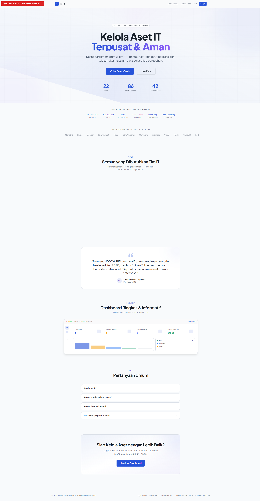
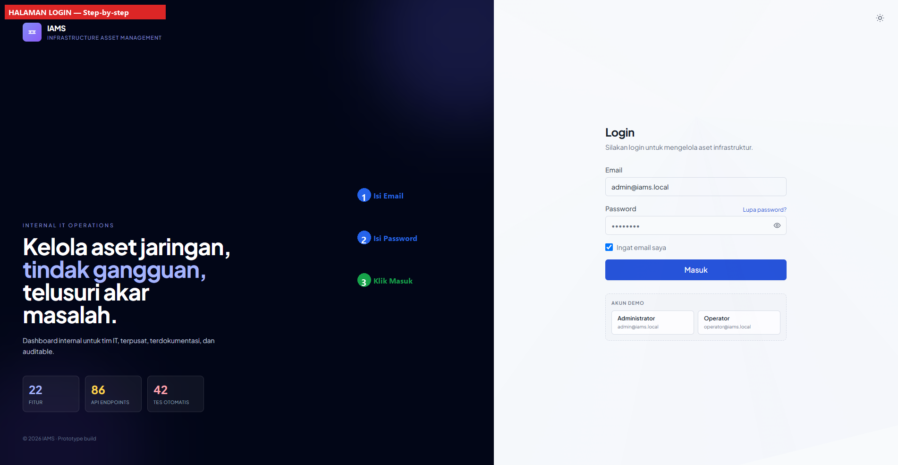
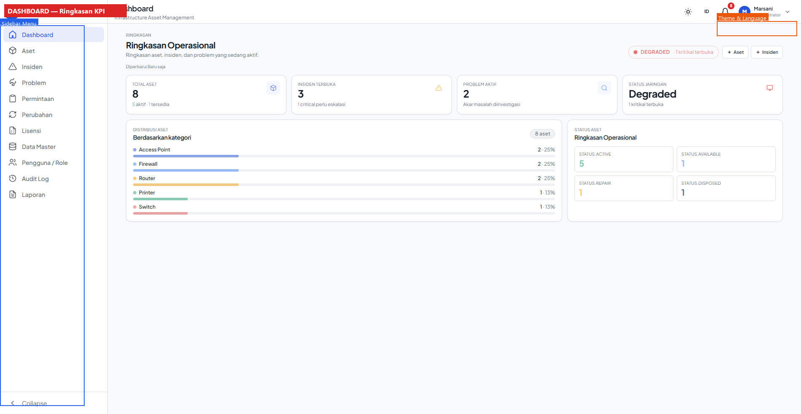
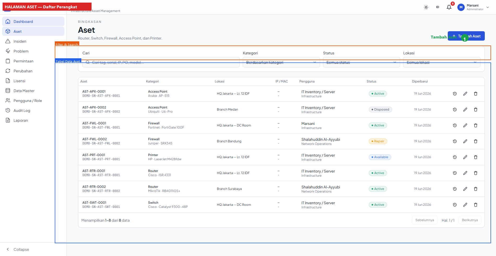
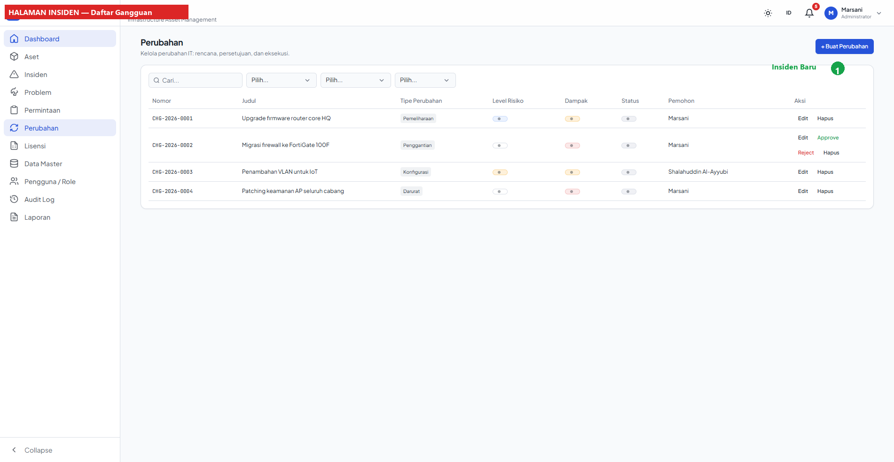
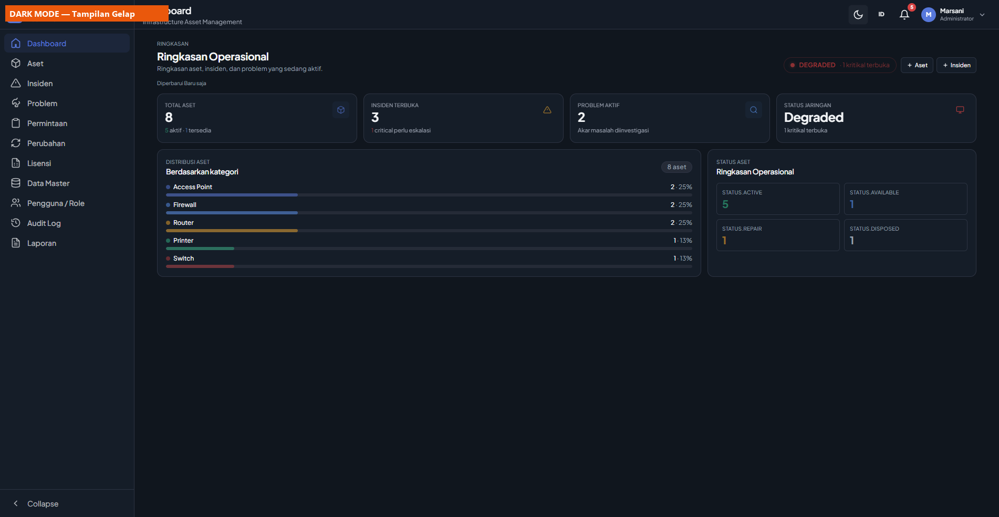

# IAMS — Infrastructure Asset Management System

[](https://vuejs.org)
[](https://flask.palletsprojects.com)
[](https://mariadb.org)
[](https://docker.com)
[](backend/tests/)
[](/LICENSE)

Dashboard internal untuk tim IT — pantau aset jaringan, tindak insiden, telusuri akar masalah, dan audit setiap perubahan. Dibangun dengan **Vue 3 + Flask + MariaDB + Docker Compose**.

    

---

## Fitur

| Modul | Deskripsi |
|-------|-----------|
| Dashboard | KPI cards, distribusi aset, status breakdown, compact no-scroll |
| Asset Management | CRUD + serial unique + network detail + credential AES-256-GCM + file upload + checkout/checkin |
| Incident Management | ITSM tracking, severity/status, assignee, auto-code INC-YYYY-NNNN |
| Problem Management | Root cause analysis, priority, owner, auto-code PRB-YYYY-NNNN |
| Request Management | 7 tipe request, filter status/priority, due date, auto-code REQ-YYYY-NNNN |
| Change Management | Approve/reject workflow, risk/impact, rollback plan, auto-code CHG-YYYY-NNNN |
| Software Licenses | Tracking lisensi: seats, expiry, product key |
| Master Data | Departments, Locations, Categories, Brands, Models — CRUD + delete safety |
| Users & Roles | RBAC Administrator/Operator, deactivate, delete |
| Reports | Full report, status summary, warranty watch, CSV export |
| Audit Logs | Append-only, metadata redacted, admin-only |
| Multi-language | Bahasa Indonesia & English, realtime switcher |
| Theme | Light / Dark, View Transitions API 120fps |
| Landing Page | Hero, features, FAQ, CTA — motion-v animations |

## Tech Stack

| Layer | Teknologi |
|-------|-----------|
| Frontend | Vue 3 + Vite 8 + Pinia + TailwindCSS 3 + vue-i18n + motion-v |
| Backend | Flask 3 + SQLAlchemy 2.0 + Alembic + Gunicorn |
| Database | MariaDB 10.11 (MySQL-compatible) |
| Cache | Redis 7 (rate limiter) |
| Reverse Proxy | Nginx (TLS 1.2/1.3, gzip, security headers) |
| Container | Docker Compose (5 services) |
| Security | JWT HttpOnly, CSRF double-submit, CORS, bcrypt 12-round, AES-256-GCM, rate limiting |

## Quick Start

```bash
# 1. Clone
git clone https://github.com/0xshalah/iams-revisi.git
cd iams-revisi

# 2. Setup environment
cp .env.example .env
# Generate secrets:
python -c "import secrets; print(secrets.token_hex(64))"          # → JWT_SECRET
python -c "import secrets,base64; print(base64.b64encode(secrets.token_bytes(32)).decode())"  # → AES_KEY_BASE64

# 3. Run
docker compose up --build -d

# 4. Seed demo data
docker exec iams_backend flask seed

# 5. Open
# Landing:  https://localhost
# Login:    https://localhost/login
# Admin:    admin@iams.local / admin123
# Operator: operator@iams.local / operator123
```

## Default Credentials

| Role | Email | Password |
|------|-------|----------|
| Administrator | admin@iams.local | admin123 |
| Operator | operator@iams.local | operator123 |

> ⚠️ Change these before any production deployment!

## Project Structure

```
├── frontend/              Vue 3 + Vite + Tailwind (14 pages, 50+ components)
├── backend/               Flask + SQLAlchemy
│   ├── app/
│   │   ├── models.py      19 SQLAlchemy models
│   │   ├── routes/        14 API blueprints (86 endpoints)
│   │   └── utils/         Security, audit, pagination, decorators
│   ├── config.py          Fail-fast secret validation
│   ├── migrations/        9 Alembic migration files
│   └── tests/             29 pytest integration tests
├── nginx/                 Reverse proxy + TLS (self-signed)
├── docs/                  Full documentation suite
│   ├── USER_MANUAL.md         Hybrid user manual (panduan + teknis + code evidence)
│   ├── DEVELOPMENT_GUIDE.md   Developer guide (setup, extend, test, deploy)
│   ├── DATABASE.md            Schema overview
│   ├── DATABASE_MAPPING.md    SQL ↔ MariaDB mapping
│   ├── PRODUCTION_HARDENING.md  Deploy checklist
│   └── screenshots/           26 annotated UI screenshots
├── docker-compose.yml     5-service orchestration
└── database.sql           Supervisor's original schema
```

## Documentation

| Document | Description |
|----------|-------------|
| [`docs/USER_MANUAL.md`](docs/USER_MANUAL.md) | Hybrid user manual — panduan pengguna + dokumentasi teknis + 20 code evidence snippets |
| [`docs/DEVELOPMENT_GUIDE.md`](docs/DEVELOPMENT_GUIDE.md) | Developer guide — local setup, ADR, migrations, how to add modules, testing |
| [`docs/DATABASE.md`](docs/DATABASE.md) | Schema overview & history |
| [`docs/DATABASE_MAPPING.md`](docs/DATABASE_MAPPING.md) | Strict mapping database.sql ↔ MariaDB |
| [`docs/PRODUCTION_HARDENING.md`](docs/PRODUCTION_HARDENING.md) | Production deployment checklist |

## Security

| Feature | Implementation |
|---------|---------------|
| Authentication | JWT in HttpOnly cookie (8h expiry) |
| CSRF | Double-submit cookie pattern |
| Password | bcrypt (12 rounds) |
| Credentials | AES-256-GCM encryption (32-byte key) |
| CORS | Explicit origin whitelist |
| Rate Limiting | 5 login/min, Redis-backed |
| RBAC | Decorator-based (`@admin_only`, `@admin_or_operator`) |
| Headers | HSTS, X-Frame-Options DENY, CSP, nosniff |
| Audit | Append-only, auto-redact sensitive metadata |
| Startup | Fail-fast — reject weak secrets at boot |

## Test

```bash
docker exec -e RATELIMIT_ENABLED=false iams_backend python -m pytest tests/ -v
# 29 passed (Auth, CSRF, RBAC, Credential Security, Validation, CRUD)
```

### Test Coverage

| Category | Tests | What's tested |
|----------|-------|---------------|
| Auth | 5 | Login success/failure, JWT not leaked, audit on failure |
| CSRF | 2 | Missing/invalid CSRF rejected |
| RBAC | 7 | Operator blocked from admin routes |
| Credential Security | 1 | No plaintext leak in responses |
| Asset Validation | 3 | Required fields, unique serial, default status |
| Audit Log | 1 | No mutating endpoints (append-only) |
| CRUD Integration | 10 | Assets, Requests, Master Data full lifecycle |

## Screenshots

<details>
<summary>Click to expand screenshots (26 annotated)</summary>

| Page | Screenshot |
|------|-----------|
| Landing Page |  |
| Login |  |
| Dashboard |  |
| Assets |  |
| Incidents |  |
| Dark Mode |  |

</details>

## Contributing

See [`docs/DEVELOPMENT_GUIDE.md`](docs/DEVELOPMENT_GUIDE.md) for:
- Local development setup (no Docker needed)
- How to add a new module (10-step tutorial)
- Database migration guide
- Testing patterns
- Code conventions

## License

MIT
